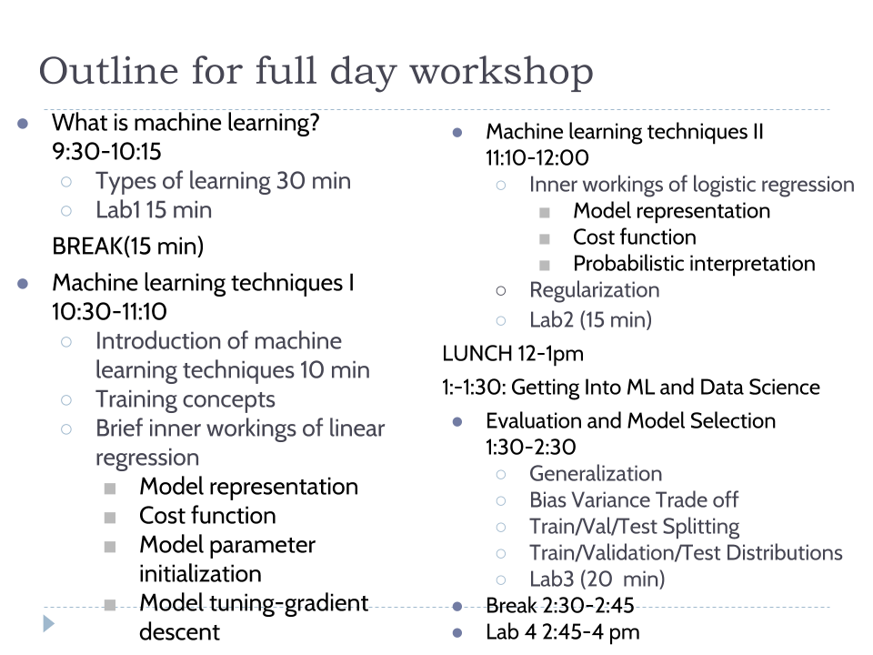

# Machine Learning Workshop 

This workshop was originally created and run by [ozzy18](https://github.com/ozzy18) and [lisafeets](https://github.com/lisafeets) for [Women Who Code](https://www.womenwhocode.com/). 

This repository contains lecture slides and python code examples to help data science newbies learn the basics of creating and evaluating machine learning models. 

To use the content found here as a full day workshop, we suggest using the following schedule

 

## Getting Started

Lecture slides (found at mlworkshop_slides.pdf), go over the fundamentals of machine learning, from definitions to building and evaluating models.

To run through the workshop labs, visit [this mybinder.org link](https://mybinder.org/v2/gh/lisafeets/machine-learning-workshop/master).

The labs have been inspired/adapted/expanded from the ["Predicting Breast Cancer - Logistic Regression"](https://www.kaggle.com/leemun1/predicting-breast-cancer-logistic-regression) Kaggle post. Data is sourced from [Breast Cancer Wisconsin (Diagnostic) Data Set](https://archive.ics.uci.edu/ml/datasets/Breast+Cancer+Wisconsin+%28Diagnostic%29). 

Labs are meant to be run in order. Executing commands in order within each lab jupyter notebook will result in locally saved data sets that can be used in the proceeding lab. Datasets for each lab are also made available in the `/data_sets` folder. Answers to exercises found in the labs are available in the `workshop_cheat_sheet.pdf`.

Lab 1. Loading and cleaning breast cancer data (jupyter notebook).

Lab 2. Worksheet to practice choosing machine learning models for business problems (pdf)

Lab 3. Simple data processing and feature selection (jupyter notebook).

Lab 4. Model application, evaluation and tuning (jupyter notebook).